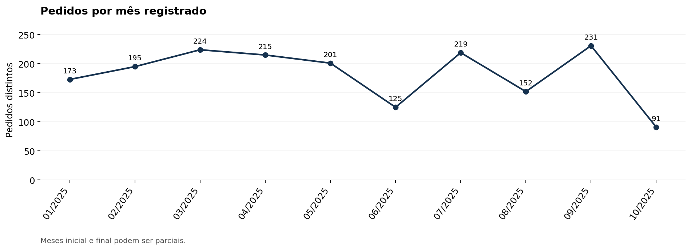

# Inteligência de expedição e rastreabilidade

**Como transformar registros manuais de carregamento em indicadores confiáveis de atendimento e qualidade de dados?**

Desenvolvi este estudo a partir de registros reais de uma operação logística, com o objetivo de analisar o atendimento dos pedidos e a qualidade dos dados de expedição.

Estruturei um fluxo de tratamento em Python, preservei os valores originais e documentei as regras de negócio. A entrega reúne uma base auditável, consultas SQL, gráficos analíticos e a preparação dos dados para Power BI.

**Python · Pandas · SQL/SQLite · Análise exploratória · Qualidade de dados · DAX**

## Problema de negócio

O diário de carregamento e o estoque eram atualizados manualmente, sem integração com um sistema. Datas conflitantes por pedido, lotes ausentes e quantidades ambíguas dificultavam uma leitura confiável da operação.

Organizei a análise em três perguntas:

- Quantos pedidos possuem registros consistentes para análise?
- Quais pedidos tiveram falta de produtos no carregamento?
- Qual parcela dos registros possui lote originalmente informado?

## Minha contribuição

- Traduzi as definições operacionais em regras de tratamento e indicadores.
- Implementei o tratamento dos dados em Python, preservando os valores de origem e registrando as alterações.
- Separei os pedidos com inconsistências sem resolução segura.
- Analisei a incidência de cortes, a evolução mensal dos pedidos e a cobertura de registro de lote.
- Preparei consultas SQL, gráficos, tabelas para um modelo estrela e medidas DAX.
- Estruturei uma demonstração pública com dados sintéticos para permitir a execução do código sem divulgar os registros empresariais.

## Resultados do estudo real

Período da base com cliente e data consistentes: **08/01/2025 a 13/10/2025**.

| Indicador | Resultado |
|---|---:|
| Linhas de itens na origem | 6.428 |
| Pedidos identificados na origem | 1.900 |
| Pedidos com cliente e data consistentes | 1.826 |
| Pedidos com ao menos um corte | 43 / 1.826 — 2,35% |
| Cobertura de lote original nas linhas de origem | 4.756 / 6.428 — 73,99% |
| Pedidos separados da base consistente para conferência | 74 |



### Interpretação e decisões sugeridas

A análise identificou 43 pedidos com falta em pelo menos um item. Esse indicador permite acompanhar a frequência de cortes na expedição; a causa das faltas depende de investigação adicional.

A cobertura de lote original foi de 73,99% das linhas de origem. Os lotes estimados permanecem identificados separadamente e não representam rastreabilidade comprovada.

Os 74 pedidos separados da base consistente evidenciam a necessidade de revisar os registros de cliente e data antes de ampliar a análise.

A partir desses achados, recomendo:

- Tornar lote e quantidade campos obrigatórios no registro de expedição.
- Revisar os pedidos com conflitos de cliente ou data.
- Investigar a disponibilidade dos produtos com cortes recorrentes, conciliando pedidos, produção e estoque.

Consulte [resultados e denominadores](docs/RESULTADOS_REAIS.md) e [metodologia](docs/METODOLOGIA.md).

Os resultados são descritivos. Não há redução de perdas, impacto financeiro ou melhoria causal medida neste estudo. Os meses inicial e final podem ser parciais.

## Executar a demonstração pública

**Os registros da demonstração são inteiramente sintéticos.** O gerador não lê as planilhas empresariais. Os indicadores gerados são próprios da demonstração e diferem dos resultados do estudo real.

Os dados originais não acompanham o repositório.

Requer **Python 3.11 ou superior**. Execute os comandos na raiz do projeto.

### 1. Criar o ambiente virtual

```bash
python -m venv .venv
```

### 2. Ativar o ambiente

No Windows PowerShell:

```powershell
.venv\Scripts\Activate.ps1
```

No macOS ou Linux:

```bash
source .venv/bin/activate
```

### 3. Instalar as dependências e executar

```bash
python -m pip install -r requirements.txt
python src/executar_demo.py
python tests/validar_demo.py
```

### 4. Consultar os resultados

Abra no navegador:

```text
outputs/demo/analise/relatorio_operacoes.html
```

A execução gera:

- Banco SQLite com registros originais, tratados e auditoria.
- Controles de qualidade e indicadores.
- Gráficos e relatório HTML.
- Arquivos CSV para construção do modelo no Power BI.

As verificações cobrem preservação dos registros, correção do ano, lotes originais e estimados, conflitos por pedido, duplicatas candidatas e cálculo dos indicadores.

Os arquivos de saída ficam fora do versionamento pelo Git.

## Organização do repositório

| Pasta ou arquivo | Conteúdo |
|---|---|
| `src/` | Geração sintética, tratamento auditável e análise |
| `sql/` | Consultas sobre o banco tratado |
| `docs/` | Resultados reais agregados, gráficos e metodologia |
| `powerbi/` | Medidas DAX e roteiro do modelo estrela |
| `data/` | Política de dados e orientação para fontes privadas |
| `tests/` | Verificações das regras de negócio da demonstração |
| `requirements.txt` | Dependências com versões fixadas |
| `.gitignore` | Exclusão de fontes privadas, ambientes e saídas |

## Regras de negócio e decisões analíticas

- **Quantidade atendida:** valor registrado em Qtde.
- **Quantidade faltante:** valor registrado em Corte. Campo vazio significa zero, conforme confirmação do responsável.
- **Quantidade solicitada:** atendida + faltante.
- **Pedido com corte:** pedido com quantidade faltante positiva em pelo menos um item.
- **Datas:** carregamentos registrados com ano 2026 foram corrigidos para 2025 por confirmação do responsável, preservando mês, dia e valor original. A regra é específica deste arquivo; datas de validade não foram alteradas.
- **Conflitos:** pedidos sem resolução segura permanecem separados da base consistente. Inferências de data são identificadas e auditadas.
- **Lotes:** valores originais são preservados; estimativas recebem identificação de não verificadas.
- **Duplicatas:** candidatas são sinalizadas e mantidas até confirmação.
- **Quantidades ambíguas:** permanecem pendentes, sem imputação automática.
- **Unidades:** taxas de atendimento em quantidade são calculadas por produto, evitando somar unidades diferentes.

## Limitações

O estoque possui atualização manual e data de referência não confirmada. Por isso, esta etapa não calcula ruptura histórica, validade atual ou utilização de capacidade.

Cortes representam falta no carregamento. Não permitem concluir atraso ou falha de entrega ao cliente.

A planilha histórica inicial foi analisada separadamente. Diferenças de layout e cadastro impedem sua integração automática ao diário de 2025 e não sustentam uma comparação de melhoria antes e depois.

## Estado do projeto

- Tratamento auditável dos dados: concluído.
- Análise exploratória e documentação: concluídas.
- Demonstração sintética executável: concluída.
- Modelo de dados e medidas para Power BI: especificados.
- Dashboard PBIX: ainda não construído.

O próximo passo é construir o dashboard com páginas de expedição, atendimento e rastreabilidade.

## Autor

**Jorge Fumagalli**

MBA em Data Science & Analytics — USP/ESALQ, concluído em 2026.

[GitHub](https://github.com/JorgeFumagalli) · [LinkedIn](https://www.linkedin.com/in/jorge-fumagalli)