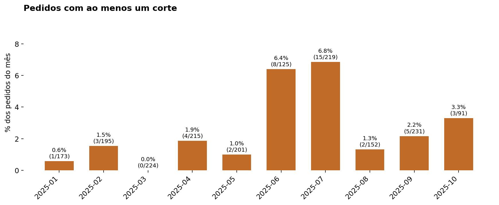
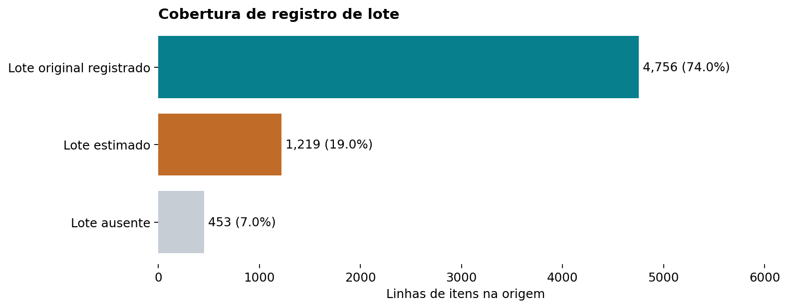

# Resultados do estudo real de 2025

Resultados descritivos calculados nas planilhas fornecidas pelo responsável. A fonte empresarial não acompanha o repositório público; a demonstração sintética não reproduz estes números.

| Indicador | Resultado e denominador |
|---|---|
| Linhas de itens na origem | 6.428 |
| Pedidos identificados | 1.900 |
| Base com cliente e data consistentes | 6.184 linhas / 1.826 pedidos |
| Pedidos separados da base consistente | 74; também há linhas sem número de pedido |
| Pedidos com ao menos um corte | 43 / 1.826 = 2,35% |
| Lote original registrado | 4.756 / 6.428 = 73,99% |
| Lote estimado, não verificado | 1.219 / 6.428 |
| Lote ainda ausente | 453 / 6.428 |
| Datas de carregamento corrigidas de 2026 para 2025 | 178 linhas |
| Quantidades sem interpretação segura | 7 linhas |
| Período da base consistente | 08/01/2025 a 13/10/2025 |

## Evidências visuais

Os meses inicial e final podem ser parciais. Cortes representam falta no carregamento; não informam atraso, entrega ao cliente ou perda financeira. Estes resultados não comprovam redução de perdas decorrente do projeto.

Recomendações: tornar lote e quantidade obrigatórios, revisar pedidos conflitantes e investigar disponibilidade dos produtos com falta recorrente. Causas e impacto financeiro dependem de dados adicionais.
